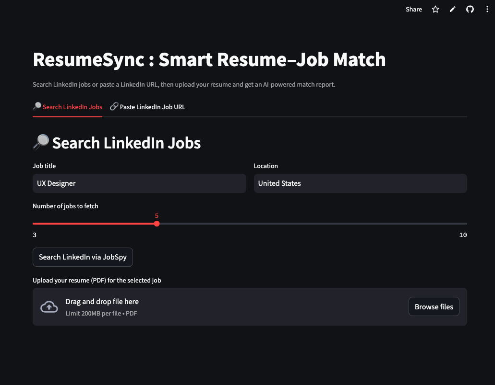

# ResumeSync User’s Guide

ResumeSync is an AI-powered assistant that compares your resume against live job postings so you know how well you match, which skills are missing, and what to improve. This README focuses on the end-user experience; developers who need implementation details should consult the [Developer’s Guide](Docs/Developer_Guide.md).


## Prerequisites

- Python 3.8+ (tested on 3.12) if you plan to run locally.
- An OpenAI API key. You can create one at https://platform.openai.com/signup and start with the free trial.
- Your resume in PDF, DOCX, or TXT format.
- Any modern browser for the hosted Streamlit app (no install required).

## Installation (For Local Use)

1. Clone or download the repository:
   ```bash
   git clone https://github.com/livitto/shakil_ATSloving.git
   cd shakil_ATSloving
   ```
2. Install the dependencies:
   ```bash
   pip install -r requirements.txt
   ```
3. Create a `.env` file in the project root and add your OpenAI key plus optional mock toggle:
   ```bash
   OPENAI_API_KEY=sk-1234567890abcdefghijklmnopqrstuvwxyz
   USE_MOCK=false  # Set to true to demo the app without API usage
   ```
4. That’s it. If `OPENAI_API_KEY` is missing, ResumeSync automatically switches to mock mode with sample data so you can still explore the UI.

## Running the App

### Option 1: Public Web App (Easiest)

Visit https://resumesyncbeta.streamlit.app/ for the hosted Streamlit experience. No setup is required.

### Option 2: Local Web App (GUI)

```bash
streamlit run app.py
```

After the server starts, open http://localhost:8501 in your browser.

### Option 3: Command-Line Interface (CLI)

```bash
python main.py
```

Follow the prompts directly in your terminal.

## How to Use ResumeSync

### Using the Web App (GUI)

1. **Access the App** – Use the public URL above or run via Streamlit locally.
2. **Search for Jobs** – In the sidebar, enter a job title (e.g., “UX Designer”) and location or paste a LinkedIn job URL. Click **Search** to pull up to five postings.
   
3. **Select a Job** – Choose one of the returned listings to load the full description.
4. **Upload Your Resume** – Drag and drop or browse for your PDF/DOCX/TXT file.
5. **Analyze** – Hit **Analyze Resume**. ResumeSync displays the match score, strengths, skill gaps, recommendations, and visual aids such as the scoreboard and bar charts.
   
6. **Extra Tools** – Use the history view to revisit prior analyses, export results to PDF, or switch to bulk analysis to compare multiple resumes in one session.

### Using the CLI

1. Run `python main.py`.
2. Choose from the menu: (1) Browse Jobs, (2) Paste URL, or (3) Exit.
3. Provide the job title/location or URL. Pick a job index (e.g., `[0] UX Designer at Apple`) to preview the description.
4. Enter the path to your resume file when prompted.
5. Read the printed summary containing the match score, strengths, gaps, and suggestions.

Example output:
```
Match Score: 75%
Strengths: Prototyping, User Research
Gaps: Accessibility, WCAG
Recommendations: Add projects related to accessibility.
```

## Possible Errors and Fixes

- **No OpenAI API key** – Set `OPENAI_API_KEY` in `.env` or use `USE_MOCK=true`.
- **Scraping failed** – The LinkedIn posting may be private or geo-restricted. Try another public URL or a VPN.
- **Unsupported file type** – Stick to PDF, DOCX, or TXT resumes.
- **LinkedIn rate limit** – Wait a few minutes between searches or keep results capped at five.
- **API costs** – Each analysis consumes OpenAI tokens (~$0.01–$0.05). Track usage via the OpenAI dashboard.

Check your terminal or Streamlit logs for more diagnostic messages, or open an issue on GitHub if the problem persists.

## Caveats and Limitations

- Currently optimized for LinkedIn postings. Other job boards were deprecated due to scraping restrictions.
- Private or login-only jobs often return placeholder descriptions.
- Mock mode is great for demos but does not reflect genuine resume quality.
- Advanced resume optimization, additional job sources, and mobile layouts are on the roadmap.
- Extremely long job descriptions may wrap oddly; refresh or collapse sections as needed.
- Heavy usage may incur OpenAI costs or hit LinkedIn limits.

For broader feature planning, consult the project specification in `Docs/ResumeSync_Project Spec_Updated.pdf`.
