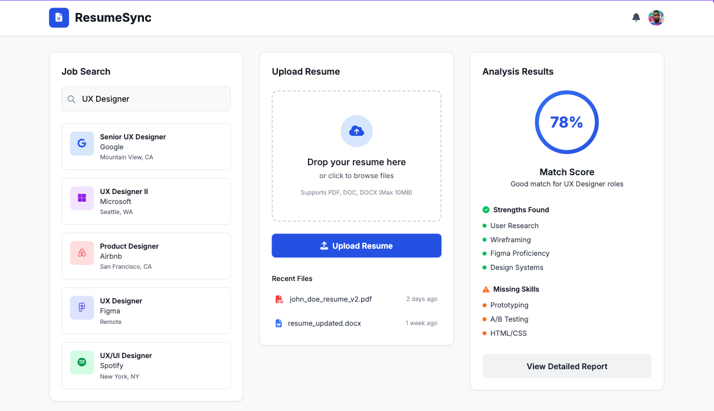

# Resume Match Checker - Project Specification

**Project Name:** ResumeSync  
**Developer:** Shamim Shakil  
**Version:** 1.0 Specification  

## General Description of the Project

ResumeSync is an intelligent job application optimization tool that helps UX designers and other job seekers maximize their interview chances by analyzing how well their resume matches specific job descriptions. As someone actively job hunting in UX, I constantly wonder if my resume contains the right keywords and skills that employers are seeking. This tool solves that problem by providing data-driven insights and actionable recommendations.

The system will scrape real job postings from LinkedIn using the JobSpy library, allow users to upload their resume, and then leverage OpenAI's API to perform intelligent analysis comparing the two documents. Unlike simple keyword matching tools, this approach understands context, identifies skill gaps, and provides nuanced feedback on how well a resume aligns with job requirements.

**External Mechanisms:**
- **JobSpy Python library** for LinkedIn job scraping
- **OpenAI API** for intelligent text analysis and comparison
- **PyPDF2** for resume text extraction
- **Streamlit** for web-based user interface

**Version 1 (Streamlit Web Interface):**
The initial version will be a simple web-based interface using Streamlit where users can search jobs through web forms, upload resumes via drag-and-drop or file picker, and view analysis results on formatted web pages. This approach ensures non-technical job seekers can use the tool without any command-line knowledge.

**Version 2 (Enhanced Web Interface):**
An improved Streamlit interface with advanced features like bulk analysis, historical tracking dashboard, resume optimization suggestions, and better data visualizations of match scores and trends.

## Task Vignettes (User Activity Flow)

### Vignette 1: Job Search and Selection
Sarah, a UX designer in Iowa, opens ResumeSync and types "UX Designer" as her search term. She leaves location blank to search nationwide. The system scrapes LinkedIn and returns 50 job postings with titles like "Senior UX Designer," "Product Designer," and "UX Researcher." She reviews the list showing company names, locations, and brief titles, then selects #3: "UX Designer at Apple - Cupertino, CA" because it matches her target role.

**Technical Details:**
- Use JobSpy library with search parameters: `search_term="UX Designer"`, `location=""`, `results_wanted=50`
- Parse returned DataFrame with columns: job_url, title, company, location, date_posted
- Present numbered list to user for selection
- Store selected job URL for later analysis
- Handle potential scraping failures with retry logic

### Vignette 2: Resume Upload and Processing
After selecting her target job, Sarah sees a file upload section with a drag-and-drop area that says "Drop your resume here or click to browse." She either drags her PDF resume file directly onto the area or clicks to open a file browser and selects her resume. The system processes the file and displays a success message showing "Resume uploaded successfully" along with the first 200 characters of extracted text for her to verify. She confirms the text looks correct and clicks "Proceed to Analysis."

**Technical Details:**
- Use Streamlit's `st.file_uploader()` for PDF, DOCX, and TXT files
- Implement PyPDF2 for PDF extraction with error handling for corrupted files
- Display extracted text preview using `st.text_area()` for user verification
- Clean text by removing excessive whitespace and special characters
- Validate minimum word count (e.g., 50 words) to ensure meaningful content
- Store processed resume text in `st.session_state` for analysis step

### Vignette 3: AI-Powered Analysis
With both her resume and target job selected, Sarah clicks the "Analyze Match" button. A progress spinner appears with the message "Analyzing your resume against the job requirements..." After 10-15 seconds, the results page loads showing her match analysis. At the top, she sees a large "7.2/10 Match Score" with an interpretation "Good match with room for improvement." Below that are organized sections: "Your Strengths" highlighting her prototyping and user research experience, "Missing Keywords" showing accessibility, design systems, and WCAG compliance, and "Recommendations" suggesting specific ways to incorporate these missing elements into her resume.

**Technical Details:**
- Create carefully crafted OpenAI prompt requesting structured analysis: match score (1-10), strengths (3-5 bullet points), missing skills (5-8 keywords), specific recommendations (3-4 actionable suggestions)
- Use GPT-3.5-turbo model with temperature=0.3 for consistent but slightly creative responses
- Include both resume text and job description URL in the prompt context
- Parse API response using regex or JSON format to extract structured components
- Display results using Streamlit columns: `st.metric()` for score, `st.success()` for strengths, `st.warning()` for gaps
- Implement error handling for API failures with fallback to simplified keyword matching
- Add cost monitoring to track OpenAI API usage per analysis

### Vignette 4: Results Review and Export Options
Sarah reviews her comprehensive analysis results displayed in an organized, easy-to-read format. She sees her match score prominently displayed, reviews the specific strengths identified in her resume, and takes notes on the missing keywords like "accessibility," "WCAG," and "design systems." At the bottom of the results page, she finds options to "Save Analysis to History" and "Export as PDF Report." She clicks save to store this analysis for future reference, then exports a PDF report that she can reference while updating her resume and writing her cover letter for this specific Apple position.

**Technical Details:**
- Format analysis results using Streamlit layout: `st.columns()` for organized sections, `st.expander()` for detailed recommendations
- Extract actionable keywords and skills from AI response using text processing
- Implement local history storage using JSON files with timestamp and job metadata
- Add PDF export functionality using `reportlab` library or Streamlit's built-in download capabilities
- Include session state management to preserve analysis data across page interactions
- Provide clear visual hierarchy with headers, bullet points, and color-coded sections (green for strengths, yellow for improvements)

## Technical Flow

### Data Flow Architecture

```
User Input (Job Search) 
    ↓
JobSpy Library → LinkedIn Scraping → Job DataFrame
    ↓
User Selection → Store Job URL
    ↓
Resume Upload → Text Extraction (PyPDF2) → Clean Text
    ↓
OpenAI API Call (Resume + Job Description) → Analysis Response
    ↓
Result Processing → Formatted Output → User Display
    ↓
Optional: Save to History (JSON file)
```

### Core Components

**1. Job Scraping Module**
- Function: `scrape_jobs(search_term, location, count=10)`
- Input: Search parameters (strings)
- Output: Pandas DataFrame with job listings  
- Implementation: JobSpy library integration with Streamlit progress indicators
- Error Handling: User-friendly error messages, retry mechanisms, fallback to cached results

**2. Resume Processing Module**
- Function: `extract_resume_text(uploaded_file)`
- Input: Streamlit file upload object
- Output: Cleaned text string
- Implementation: PyPDF2 for PDFs, python-docx for Word files
- Data Types: File processing with validation and preview functionality

**3. AI Analysis Module**
- Function: `analyze_resume_match(resume_text, job_description)`
- Input: Resume text (string), Job description (string from URL)
- Output: Structured analysis dictionary (score, strengths, gaps, recommendations)
- Implementation: OpenAI API with structured prompt engineering
- Cost Management: Track API usage, implement caching for repeated analyses

**4. Results Display Module**
- Function: `display_analysis_results(analysis_data)`
- Input: Analysis results dictionary
- Output: Formatted Streamlit interface with organized sections
- Features: Visual score display, color-coded sections, export options

**5. Streamlit Web Interface**
- Function: `main_streamlit_app()`
- Handles all user interactions through web interface
- State management using `st.session_state`
- Navigation between job search, upload, analysis, and results pages

### Key Data Structures

- **Job DataFrame:** Columns include job_url, title, company, location, date_posted
- **Resume Text:** String with cleaned, extracted content
- **Analysis Results:** Dictionary with keys: score, strengths, missing_skills, recommendations
- **History Data:** List of dictionaries with timestamp, job_info, analysis_results

## Final Self Assessment

**Biggest Change from Sketch:**
The most significant change is incorporating AI analysis instead of simple keyword matching. This makes the project much more sophisticated and valuable, but also introduces dependency on external APIs and increases complexity.

**Implementation Confidence:**
I feel reasonably confident (7.5/10) about implementing this specification. The Streamlit framework significantly simplifies web interface development compared to building a traditional web application. The individual technical components—file processing, API integration, and data handling—are within my current skill level. However, the integration challenges and external dependencies (JobSpy reliability, OpenAI API consistency) present the main risks.

**Biggest Potential Problem:**
OpenAI API cost management is the most critical challenge. With analysis costs potentially ranging from $0.01-$0.05 per job analysis, expenses could accumulate quickly during development and testing. If API costs become prohibitive or the service experiences outages, I need a fallback plan using basic keyword matching algorithms to ensure the core functionality remains available.

**Areas Needing Help:**
- **Prompt Engineering:** Crafting OpenAI prompts that consistently return structured, actionable analysis rather than generic feedback
- **JobSpy Integration:** Setting up the library correctly and troubleshooting potential LinkedIn anti-scraping measures  
- **Streamlit State Management:** Properly handling user data flow between different pages and maintaining session state
- **Error Handling Strategy:** Building robust fallbacks when external services fail
- **Cost Optimization:** Implementing efficient API usage patterns and caching strategies

**Additional Technical Considerations:**
- Implement local caching system to avoid re-analyzing identical resume/job combinations
- Add basic analytics to track successful analyses vs. failures for debugging
- Plan for API rate limiting with user-friendly waiting periods
- Consider offering both free (limited) and paid (unlimited) analysis tiers for future sustainability
- Design modular architecture to easily swap AI providers if needed

## Creative Visualization

I tried to visualize it creatively; my app version may not be the exact (due to more technical requirements and coding ability) but will to make it more appealing.



*The mockup shows a clean, three-panel interface with job search results on the left, resume upload in the center, and analysis results displaying match scores and recommendations on the right. The actual implementation will focus on core functionality first, with visual enhancements added progressively.*
